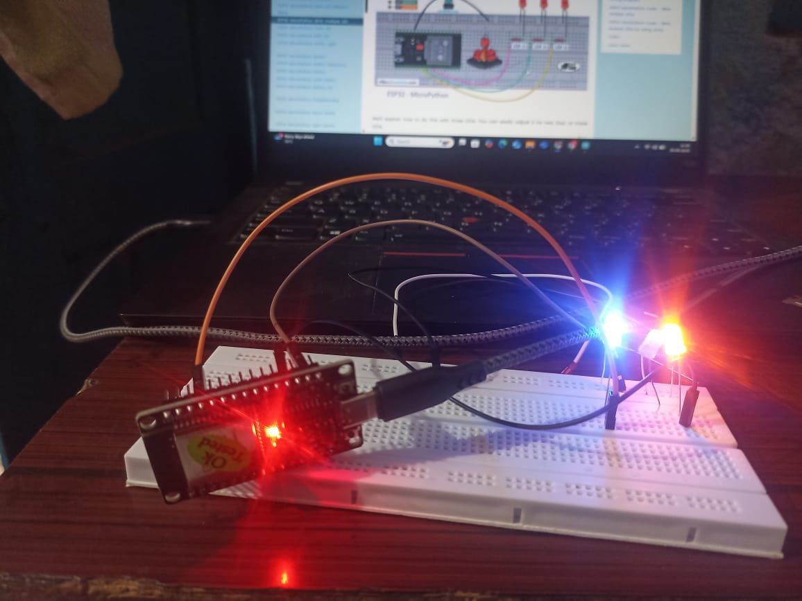
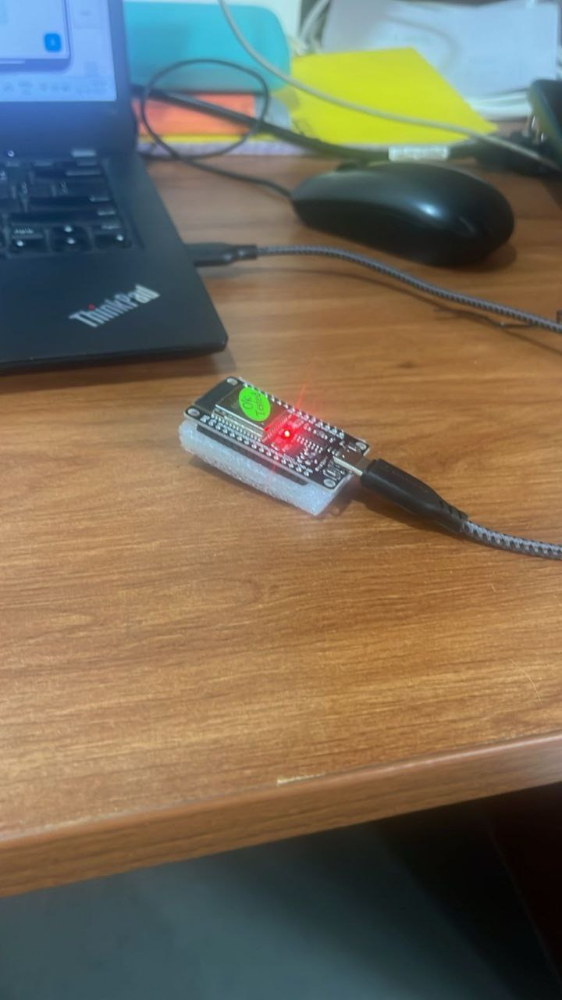

# 📡 Bluetooth-ESP32-Controller

A simple proof-of-concept project to demonstrate wireless communication between an **Android app** and an **ESP32 microcontroller** over Bluetooth.  
The Android app sends simple control commands, and the ESP32 receives and processes them. This project serves as a foundation for future IoT and automation integrations.

---

## 🚀 Features

- 📱 Android app built in Android Studio to send Bluetooth commands (`ON`, `OFF`).
- 🔌 ESP32 receives commands using Bluetooth Serial and prints them over Serial Monitor.
- 🔧 Expandable for controlling LEDs, motors, relays, or other devices.
- 📸 Includes photos of the project in action.

---

## 🔨 Project Structure

```
Bluetooth-ESP32-Controller/
├── android-app/               # Android Studio project (Bluetooth sender app)
├── esp32-firmware/             # ESP32 Arduino sketch (Bluetooth receiver)
├── images/                     # Demo images of the working setup
├── README.md                    # This file
├── LICENSE                      # MIT License (optional)
└── .gitignore                   # Ignore build and IDE files
```

---

## 📲 Android App Setup

1. Open the `android-app/` folder in Android Studio.
2. Update the **Bluetooth MAC Address** in `MainActivity.java`:  
   ```java
   private static final String DEVICE_ADDRESS = "XX:XX:XX:XX:XX:XX"; // Replace with your ESP32's address
   ```
3. Build and install the app on your Android phone.
4. Pair your phone with the ESP32 via Bluetooth settings.
5. Run the app and press the **"Turn ON"** and **"Turn OFF"** buttons to send commands.

---

## 🔌 ESP32 Firmware Setup

1. Open `esp32-firmware/esp32-bluetooth.ino` in the Arduino IDE.
2. Select your ESP32 board (e.g., ESP32 Dev Module).
3. Upload the sketch to your ESP32.
4. Open the Serial Monitor to view received messages.

---

## 📸 Demo

| ESP32 Setup | Working Demo |
|-------------|--------------|
|  |  |

*(Replace with your actual image file names in the `/images` folder.)*

---

## 🔮 Future Plans

- Add real-world device control (e.g., LED, relay).
- Implement bidirectional communication.
- Create a polished Android UI.
- Expand to Wi-Fi and cloud integration.

---

## 🛡️ License

This project is licensed under the **MIT License** — see the [LICENSE](LICENSE) file for details.

---

## 🙌 Acknowledgements

- ESP32 BluetoothSerial library
- Android BluetoothAdapter documentation
- Inspired by personal IoT automation needs
